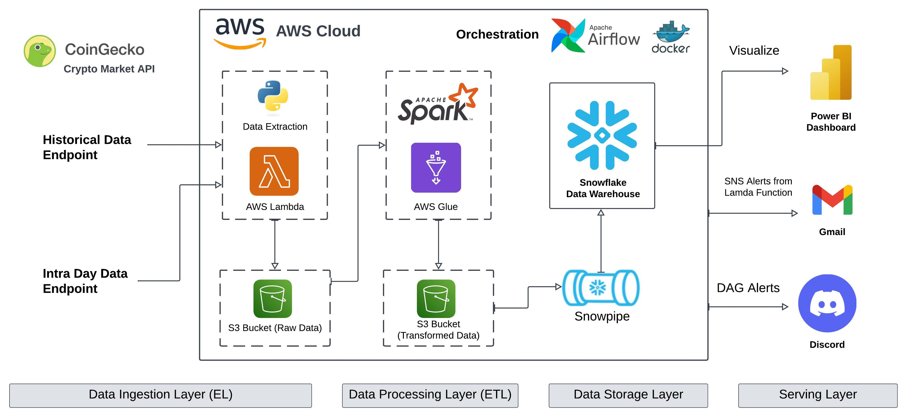

# Crypto Data Pipeline — AWS Glue, Lambda, S3, Snowflake, Airflow
A scalable crypto data pipeline that ingests from API, transforms, stores, and loads crypto currencies historical and intra day data using AWS services and Snowflake. Airflow orchestrates the entire pipeline and, CI/CD fully automated through GitHub Actions.

## Architecture Diagram



## 📚 Project Overview

| Component              | Tool / Service                |
|------------------------|-------------------------------|
| Data Ingestion         | AWS Lambda                    |
| Data Transformation    | AWS Glue (PySpark)            |
| Storage                | AWS S3                        |
| Data Warehouse         | Snowflake                     |
| Orchestration          | Apache Airflow                |
| CI/CD / Devops         | GitHub Actions, Docker        |
| Region Alignment       | eu-north-1 (Stockholm)        |
| Alerts/Obserability    | AWS SNS, Discord DAG Alerts   |

---

## Project Structure

```

crypto-currency-data-pipeline/
└── .github/
  └── workflows/
    └── deploy_lambda_glue.yml
└── assets/
└── dags/
  └── crypto_historical_data_dag.py
  └── crypto_intra_day_dag.py
└── glue_jobs/
  └── historical_data_transformation.py
  └── intra_day_transformation.py
└── lambda_funcs/
  └── app.py
└── tests/ 
  └── __init__.py
  └── test_main.py
└── .gitignore
└── README.md
└── docker-compose.yaml
└── requirements.txt

```

---

## 🔗 Pipeline Flow

1. **Lambda Functions**
   - Pull historical and intraday data from the CoinGecko API.
   - Store raw JSON data in S3 buckets.

2. **AWS Glue Jobs**
   - Clean, transform, and flatten raw data using PySpark.
   - Save processed data back to S3 in Parquet format.

3. **Snowflake Loader**
   - Use Snowflake external stage and COPY INTO/Snowpipe commands to load data from S3.
   - Maintain historical and intraday tables for efficient querying.

4. **Airflow DAGs**
   - Orchestrate the full pipeline with dependency management.
   - Run Lambda -> Run Glue Jobs -> Snowpipe Refresh
   - Handle retries, alerts, and errors.

5. **CI/CD**
   - GitHub Actions run tests and deploy updated Lambda, Glue, and DAG code.
   - Workflow is triggered on changes to lambda_funcs, glue_scripts, or dags.

---

## 📦 S3 Structure
```
s3://crypto-raw-data-abk/
└── historical_data/
└── intraday_data/

s3://crypto-transformed-data-abk/
└── historical_data/
└── intraday_data/
```


---


## ✅ Testing

- Unit tests for:
  - API reachability (CoinGecko)
  - S3 buckets existence
  - Glue script validation
  - SNS alerts

---

## 🚨 Alerts

- SNS topics notify stakeholders of failures in:
  - Lambda ingestion

- DAG Alerts with `DiscordNotifier`
  - Notify on every successful pipeline run.
  - Task level alerts on failures

 ---

 
## 🔧 Installation & Setup

### 1. Prerequisites

- AWS Account (Can be free tier also)
- Snowflake Account
- Python ≥ 3.9
- Docker & Docker Compose
- AWS CLI configured (with access keys and default region)
- Discord with Webhook configured on a channel.
- GitHub repository connected
- CoinGecko API Key (Get yours now: https://www.coingecko.com/en/api)

### 2. Clone the Repository

```bash
git clone https://github.com/your-username/crypto-data-pipeline.git
cd crypto-data-pipeline
```

### 3. Set up Python environment

```bash
python3 -m venv venv
source venv/bin/activate
pip install -r requirements.txt
```

### 4. AWS Setup
Ensure your AWS CLI is configured:

```bash
aws configure
```

Provide:
- AWS Access Key ID
- AWS Secret Access Key
- Default Region Name (e.g., eu-north-1)
- Default Output Format (e.g., json)


- Create two S3 buckets:
  - s3://crypto-raw-data-abk/
    - historical_data/
    - intraday_data/
  - s3://crypto-transformed-data-abk/
    - historical_data/
    - intraday_data/

- Create IAM roles for:
  - Lambda (with S3, SNS, CloudWatch permissions)
  - Glue (with S3, Glue, CloudWatch permissions)
 
- CLI Commands to manage Lambda:

  ```bash
  # Create Lambda function
  aws lambda create-function \
    --function-name crypto_data_fetch \
    --runtime python3.10 \
    --role arn:aws:iam::<your-account-id>:role/<your-lambda-role> \
    --handler app.lambda_handler \
    --zip-file fileb://function.zip

  # Update existing Lambda function
  aws lambda update-function-code \
    --function-name fetch_crypto_api \
    --zip-file fileb://function.zip
  ```

- Create an IAM Role for Glue with the following permissions:
  - AmazonS3FullAccess (or scoped to your crypto buckets)
  - AWSGlueServiceRole
  - CloudWatchLogsFullAccess

- Upload your Glue PySpark scripts to S3 or maintain them locally for development.
  ```bash
    aws s3 cp glue_jobs/historical_data_transformation.py s3://<glue-script-bucket>/scripts/
    aws s3 cp glue_jobs/intra_day_transformation.py s3://<glue-script-bucket>/scripts/
  ```

- Create Glue Jobs:
  - Type: Spark
  - Language: Python
  - Script path: s3://<glue-script-bucket>/scripts/
  - IAM Role: previously created Glue role

### 5. Snowflake Setup
- Setup snowflake account, create database, schema, warehouse
- Create a user with the appropriate role and permissions
- Follow this link to create and configure Snowpipe for AWS S3 ( https://docs.snowflake.com/en/user-guide/data-load-snowpipe-auto-s3 )

### 6. Airflow Setup
- Install dependencies and run Airflow via Docker Compose (Can also be configure directly)
- Tutorial Link: https://airflow.apache.org/docs/apache-airflow/stable/howto/docker-compose/index.html
- Setup Connection in Airflow UI For:
   - AWS : https://airflow.apache.org/docs/apache-airflow-providers-amazon/stable/connections/aws.html
   - Snowflake: https://airflow.apache.org/docs/apache-airflow-providers-snowflake/stable/connections/snowflake.html
   - Discord: https://airflow.apache.org/docs/apache-airflow-providers-discord/stable/_api/airflow/providers/discord/notifications/discord/index.html

### 7. GitHub Actions
CI/CD configured to trigger on changes in:

- lambda_funcs/
- glue_scripts/
- dags/

Workflow is defined in .github/workflows directory.

--- 

## 📍 Notes
- Snowpipe cannot overwrite; truncation must be handled manually or via DAG before ingestion
- Only one location allowed per Snowflake stage
